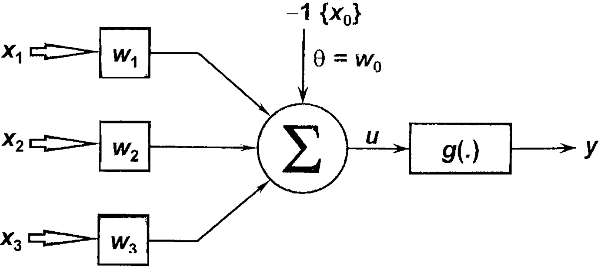

# Redes-Neurais-FIA-T02
Segundo trabalho prático da disciplina de Introdução a Inteligência Artificial.

## Enunciado:
Pela análise de um processo de destilação fracionada de petróleo observou-se que determinado óleo
poderia ser classificado em duas classes de pureza {P1 e P2} a partir da medição de três grandezas
{x1, x2 e x3}, que representam algumas de suas propriedades físico-químicas. A equipe de
engenheiros e cientistas pretende usar urna rede Perceptron para executar a classificação automática
das duas classes.
Assim, baseado nas informações coletadas do processo, formou-se o conjunto de treinamento
apresentado no apêndice I, tomando por convenção o valor -1 para óleo pertencente à classe P1 e o
valor 1 para óleo pertencente à classe P2. Para tanto, o neurônio constituinte do Perceptron terá
então três entradas e uma saída conforme ilustrado na figura abaixo. 

  
**Figura 1: Arquitetura do Perceptron para o projeto prático**

## Exercício

Utilizando o algoritmo supervisionado de Hebb (regra de Hebb) para classificação de padrões, e
assumindo-se a taxa de aprendizagem como 0,01, faça as seguintes atividades:

1) Execute cinco treinamentos para a rede Perceptron, iniciando o vetor de pesos {w} em cada
treinamento com valores aleatórios entre zero e um. Se for o caso, reinicie o gerador de
números aleatórios em cada treinamento de tal forma que os elementos do vetor de pesos
iniciais não sejam os mesmos. O conjunto de treinamento encontra-se no [anexo](anexo).

2) Registre os resultados dos cinco treinamentos na tabela apresentada a seguir

<table>
  <tr>
    <th rowspan="2">Treina mento</th>  <th colspan="4">Vetor de Pesos</th>  <th colspan="4">Vetor de Pesos Finais</th>  <th>Número de Épocas</th>
  </tr>
  <tr>
    <td>w0</td> <td>w1</td> <td>w2</td> <td>w3</td> <td>w0</td> <td>w1</td> <td>w2</td> <td>w3</td> <td></td>
  </tr>
  <tr>
    <td>T1</td><td>-1.0000</td><td>0.5634</td><td>0.356</td><td>0.4092</td><td>-1.0000</td><td>0.9516</td><td>1.3682</td><td>-0.4459</td><td>107</td>
  </tr>
  <tr>
    <td>T2</td><td>-1.0000</td><td>0.2234</td><td>0.822</td><td>0.4269</td><td>1.0000</td><td>0.9301</td><td>1.4135</td><td>-0.4453</td><td>85</td>
  </tr>
  <tr>
    <td>T3</td><td>1.0000</td><td>0.3069</td><td>0.0803</td><td>0.5869</td><td>-1.0000</td><td>0.9324</td><td>1.4149</td><td>-0.4461</td><td>117</td>
  </tr>
  <tr>
    <td>T4</td><td>1.0000</td><td>0.469</td><td>0.1863</td><td>0.6599</td><td>-1.0000</td><td>0.9319</td><td>1.4153</td><td>-0.4458</td><td>115</td>
  </tr>
  <tr>
    <td>T5</td><td>1.0000</td><td>0.3789</td><td>0.5051</td><td>0.3436</td><td>1.0000</td><td>0.9385</td><td>1.3891</td><td>-0.4453</td><td>91</td>
  </tr>
</table>

**Tabela 1 - Resultados dos treinamentos do Perceptron**

3) Após o treinamento do Perceptron, coloque este em operação, aplicando-o na classificação
automática das amostras de óleo da tabela 1.2, indicando ainda nesta tabela aqueles
resultados das saídas (Classes) referentes aos cinco processos de treinamento realizados no
item 1.

<table>
  <tr>
    <th>Amostra</th><th>x1</th><th>x2</th><th>x3</th><th>Y(T1)</th><th>Y(T2)</th><th>Y(T3)</th><th>Y(T4)</th><th>Y(T5)</th> </tr>
  <tr>
    <td>1</td><td>-0,3665</td><td>0,0620</td><td>5,9891</td><td>-1</td><td>-1</td><td>-1</td><td>-1</td><td>-1</td>
  </tr>
  <tr>
    <td>2</td><td>-0,7842</td><td>1,1267</td><td>5,5912</td><td>+1</td><td>+1</td><td>+1</td><td>+1</td><td>+1</td>
  </tr>
  <tr>
    <td>3</td><td>0,3012</td><td>0,5611</td><td>5,8234</td><td>+1</td><td>+1</td><td>+1</td><td>+1</td><td>+1</td>
  </tr>
  <tr>
    <td>4</td><td>0,7757</td><td>1,0648</td><td>8,0677</td><td>+1</td><td>+1</td><td>+1</td><td>+1</td><td>+1</td>
  </tr>
  <tr>
    <td>5</td><td>0,1570</td><td>0,8028</td><td>6,3040</td><td>+1</td><td>+1</td><td>+1</td><td>+1</td><td>+1</td>
  </tr>
  <tr>
    <td>6</td><td>-0,7014</td><td>1,0316</td><td>3,6005</td><td>+1</td><td>+1</td><td>+1</td><td>+1</td><td>+1</td>
  </tr>
  <tr>
    <td>7</td><td>0,3748</td><td>0,1536</td><td>6,1537</td><td>-1</td><td>-1</td><td>-1</td><td>-1</td><td>-1</td>
  </tr>
  <tr>
    <td>8</td><td>-0,6920</td><td>0,9404</td><td>4,4058</td><td>+1</td><td>+1</td><td>+1</td><td>+1</td><td>+1</td>
  </tr>
  <tr>
    <td>9</td><td>-1,3970</td><td>0,7141</td><td>4,9263</td><td>-1</td><td>-1</td><td>-1</td><td>-1</td><td>-1</td>
  </tr>
  <tr>
    <td>10</td><td>-1,8842 </td><td>0,2805</td><td>1,2548</td><td>+1</td><td>+1</td><td>+1</td><td>+1</td><td>+1</td>
  </tr>
</table>

**Tabela 1.2 — Amostras de óleo para validar a rede Perceptron**

4) Explique por que o número de épocas de treinamento , em relação a esta aplicação, varia
cada vez que executamos o treinamento do Perceptron.

Como a geração dos pesos se da por meio aleatório, isso faz com que o numero de épocas varie a partir de tais pesos. Pois dependendo dos pesos gerados ele pode levar leva mais ou menos interações para convergirem, os pesos sempre convergem para valores semelhantes.

5) Para a aplicação em questão, discorra se é possível afirmar se as suas classes são
linearmente separáveis.
(Exercício do livro: Redes neurais artificiais para engenharia e ciências aplicadas )

As classes são linearmente separaveis na medida que usamos o valor -5 como separatriz, pois tal valor separa em duas clases de valores os resultados calculados pela rede. 

# Anexo

[Conjunto de treinamento](res/anexo1.txt)
